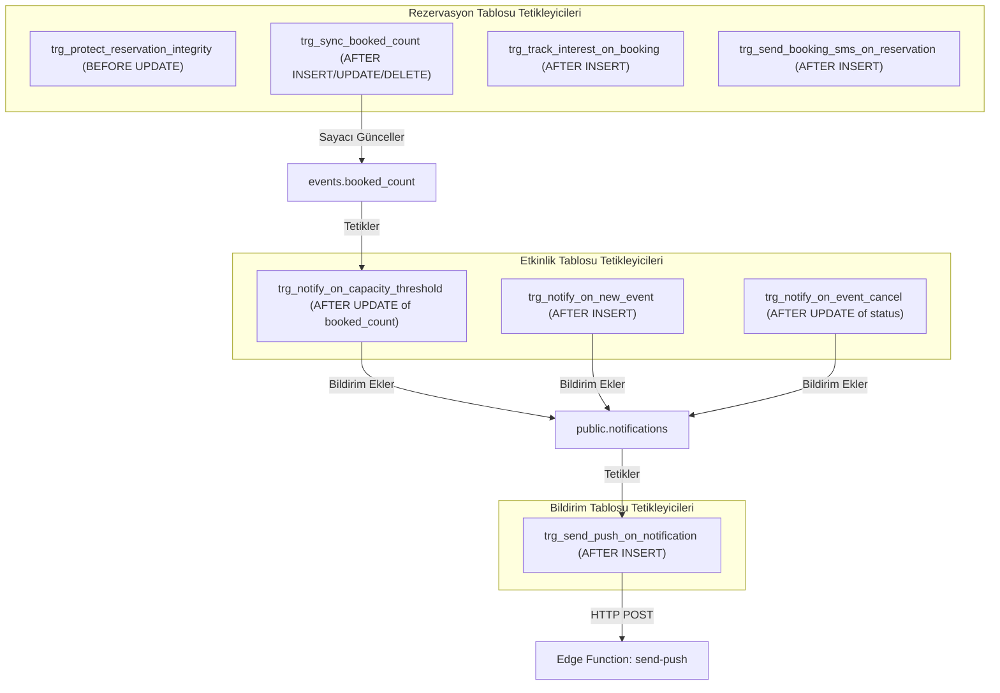

# Veritabanı ve Şema Haritası (database-map.md)

Bu doküman, yerel migration dosyalarının (0001 - 0030) kronolojik analizine dayalı olarak şemanın evrimini, tabloları, RLS politikalarını, RPC fonksiyonlarını ve trigger yan etkilerini açıklar.

> [!NOTE]
> Bu analiz yerel migration dosyalarının sırasıyla incelenmesiyle oluşturulmuştur. Uzak üretim veritabanına doğrudan bağlantı yetkisi bulunmadığından, canlı veritabanında elle uygulanmış olabilecek dış müdahaleler bu haritanın kapsamı dışındadır.

---

## 1. Migration Kronolojisi ve Politika Evrimi

Supabase migration'larında sıklıkla `DROP POLICY IF EXISTS` + `CREATE POLICY` yöntemi kullanılarak önceki kurallar ezilmiştir. Güncel davranışı anlamak için bu evrim sırasıyla takip edilmelidir:

| No | Migration Adı | Temel Değişiklikler ve Evrim |
| :--- | :--- | :--- |
| `0001` | `initial_schema.sql` | `users`, `events`, `reservations` tabloları. `is_admin()` fonksiyonu. Temel RLS politikaları. İlk ilkel `book_event` RPC'si. |
| `0002` | `seed_data.sql` | Başlangıç admini ve örnek etkinlik kayıtları. |
| `0003` | `rls_updates.sql` | `reservations: users update own` politikası eklendi (kullanıcıların kendi rezervasyonlarını iptal edebilmesi için). `events` politikası genişletildi (`status IN ('active', 'completed')`). |
| `0004` | `storage_bucket.sql` | `event-banners` Supabase Storage bucket'ı oluşturuldu ve genel okuma izni verildi. |
| `0005` | `core_overhaul.sql` | `users` tablosuna `approval_status` ('pending', 'approved', 'rejected') eklendi. Supabase auth trigger'ı `handle_new_user` tanımlandı. |
| `0006` | `advanced_booking.sql` | `reservation_audit_logs` tablosu. İlk `sync_booked_count` ve `trg_reservation_audit` denemeleri. |
| `0007` | `phase7_hotfixes.sql` | `sync_booked_count` trigger mantığında ilk düzeltmeler. |
| `0008` | `profile_rls_fix.sql` | Kullanıcıların kendi profillerini güncelleyebilmesi için RLS izinleri düzeltildi. |
| `0009` | `final_qa_fixes.sql` | Rezervasyon senkronizasyonunda QA düzeltmeleri. |
| `0010` | `production_hardening.sql` | `trg_protect_user_privileges` (rol yükseltmeyi önleme). `trg_protect_reservation_integrity` (`event_id` ve `user_id` değişimini önleme). İndeksler ve `event-banners` bucket boyut/mime sınırları. |
| `0011` | `final_production_cleanup.sql` | Eski `book_event` fonksiyon imzalarının temizliği. |
| `0012` | `notification_system.sql` | `notifications` tablosu, RLS politikaları. `trg_notify_on_event_cancel` ve `trg_notify_on_new_event` trigger'ları. |
| `0013` | `capacity_alert_trigger.sql` | `user_interests` tablosu. `trg_track_interest_on_booking`. Kapasite %90'a ulaştığında veya son 5 koltuk kaldığında ilgi duyanlara bildirim atan `trg_notify_on_capacity_threshold`. |
| `0014` | `admin_booking_security.sql` | `book_event` RPC'sinin güvenlik revizyonu. `sync_booked_count` trigger'ının tek sayaç otoritesi haline getirilmesi. |
| `0015` | `admin_overrides_notif_delete.sql` | **Definitive booking sürümü:** Adminlerin kapasite/limit kısıtlamalarını bypass edebilmesi. `notifications_delete_own` (kullanıcıların kendi bildirimlerini silebilmesi). |
| `0016` | `support_system_and_realtime.sql` | `support_tickets` ve `ticket_messages` tabloları, RLS ve realtime yayın yetkileri. |
| `0017` | `rich_event_seeds.sql` | 16 adet zengin demo etkinlik tohum verisi. |
| `0018` | `ticket_reply_notification_trigger.sql` | Admin desteğe yanıt verdiğinde kullanıcıya bildirim üreten ilk trigger. |
| `0019` | `patch_ticket_reply_link_url.sql` | Bildirim link URL'i yaması. |
| `0020` | `security_patch_and_links.sql` | **Definitive ticket sürümü:** `ticket_messages` için `sender_role` ve `sender_id` sahteciliğini önleyen RLS. Bildirimlere `/profile?tab=support&ticketId=<id>` deep linki ekleyen nihai trigger. |
| `0021` | `push_token.sql` | `public.users` tablosuna `push_token TEXT` eklendi. |
| `0022` | `send_push_webhook.sql` | `pg_net` ile `notifications` INSERT anında `send-push` Edge Function'ını çağıran webhook trigger'ı. |
| `0023` | `fix_http_post_wrapper.sql` | `extensions.http_post` parametre sarmalayıcısı. |
| `0024` | `definitive_http_post_fix.sql` | **Definitive webhook sarmalayıcısı:** `url` veya `uri` alan, Expo push fallback'li `extensions.http_post` fonksiyonu. |
| `0025` | `categories_pricing_privacy_and_sms.sql` | `event_categories` tablosu. `events.price` ve `events.category_id`. `users.is_private` ve `users.phone_number`. `send-booking-sms` webhook trigger'ı. |
| `0026` | `privacy_defaults_and_attendees_rls.sql` | Varsayılan gizlilik `true` yapıldı. Güvenli karşılıklı katılımcı RPC'si `get_public_event_attendees`. Kategori renk paleti tohumlama. |
| `0027` | `privacy_cooldown_and_category_sync.sql` | Eski metin kategorilerin `event_categories` ile senkronizasyonu. 24 saatlik `trg_enforce_privacy_cooldown`. |
| `0028` | `avatar_storage_setup.sql` | `avatars` Supabase Storage bucket'ı oluşturuldu (5MB limit, webp/png/jpeg/gif izinleri, genel okuma, kullanıcının kendi avatarını yazma/silme RLS politikaları). |
| `0029` | `event_soft_delete_and_status.sql` | **Definitive event RLS:** `events.is_archived` kolonu. `events: users view active or completed` politikası güncellendi (`status IN ('active', 'completed') AND is_published = true AND is_archived = false`). |
| `0030` | `attendee_visibility_non_reciprocal.sql` | *(Yerel / Uncommitted)* `is_private` varsayılanı `false` yapıldı. `get_public_event_attendees` tek taraflı hale getirildi (istek sahibinin gizli olması başkalarını görmesine engel değil). |

---

## 2. Güncel Tablo Şemaları ve Görevleri

### 2.1. `public.users`
- **Sütunlar:** `id` (UUID, PK), `email` (TEXT), `full_name` (TEXT), `role` (TEXT: 'admin'|'user'), `approval_status` (TEXT: 'pending'|'approved'|'rejected'), `phone_number` (TEXT), `address` (TEXT), `avatar_url` (TEXT), `is_private` (BOOLEAN), `privacy_changed_at` (TIMESTAMPTZ), `push_token` (TEXT), `created_at` (TIMESTAMPTZ).
- **RLS:** Kullanıcılar sadece kendi satırlarını okuyabilir ve ad/telefon/adres/gizlilik güncelleyebilir. Rol veya onay durumunu değiştiremez (`trg_protect_user_privileges`).

### 2.2. `public.events`
- **Sütunlar:** `id` (UUID, PK), `title` (TEXT), `description` (TEXT), `image_url` (TEXT), `event_date` (TIMESTAMPTZ), `capacity` (INT), `booked_count` (INT, varsayılan 0), `max_tickets_per_user` (INT, varsayılan 5), `price` (NUMERIC, varsayılan 0), `category` (TEXT, geriye dönük uyumluluk), `category_id` (UUID, FK -> `event_categories.id`), `location` (TEXT), `closing_comment` (TEXT), `is_published` (BOOLEAN, varsayılan true), `is_archived` (BOOLEAN, varsayılan false), `status` (TEXT: 'active'|'cancelled'|'completed'), `created_at` (TIMESTAMPTZ).
- **RLS:**
  - Admin: FOR ALL izni.
  - Normal Kullanıcılar: Yalnızca `status IN ('active', 'completed') AND is_published = true AND is_archived = false` koşulunu sağlayan satırları SELECT edebilir.

### 2.3. `public.reservations`
- **Sütunlar:** `id` (UUID, PK), `event_id` (UUID, FK -> `events.id`), `user_id` (UUID, FK -> `users.id`), `status` (TEXT: 'confirmed'|'cancelled'), `tickets_requested` (INT, varsayılan 1), `created_at` (TIMESTAMPTZ).
- **Kısıt:** `UNIQUE (user_id, event_id)` — Bir kullanıcının bir etkinlikte yalnızca tek bir rezervasyon satırı olabilir.
- **RLS:** Kullanıcılar kendi rezervasyonlarını SELECT edebilir ve `status = 'cancelled'` veya `tickets_requested` UPDATE edebilir.

### 2.4. `public.event_categories`
- **Sütunlar:** `id` (UUID, PK), `name` (TEXT, UNIQUE), `color_code` (TEXT), `created_at` (TIMESTAMPTZ).
- **RLS:** Herkese açık SELECT izni. Yalnızca adminler INSERT/UPDATE/DELETE yapabilir.

### 2.5. `public.notifications`
- **Sütunlar:** `id` (UUID, PK), `user_id` (UUID, FK -> `users.id`), `title` (TEXT), `message` (TEXT), `type` (TEXT: 'new_event'|'cancelled_event'|'admin_broadcast'|'capacity_alert'|'ticket_reply'), `is_read` (BOOLEAN, varsayılan false), `link_url` (TEXT), `created_at` (TIMESTAMPTZ).
- **RLS:** Kullanıcılar kendi bildirimlerini SELECT, UPDATE (`is_read`) ve DELETE edebilir. Adminler tüm kullanıcılara bildirim INSERT edebilir.

### 2.6. `public.support_tickets` ve `public.ticket_messages`
- **`support_tickets`:** `id`, `user_id`, `subject`, `status` ('open'|'in_progress'|'resolved'), `created_at`.
- **`ticket_messages`:** `id`, `ticket_id`, `sender_id`, `sender_role` ('user'|'admin'), `message`, `created_at`.
- **RLS:** Kullanıcı yalnızca kendi biletlerini ve mesajlarını okuyabilir; mesaj eklerken `sender_id = auth.uid()` ve `sender_role = 'user'` olmak zorundadır (`0020_security_patch_and_links.sql`).

---

## 3. Kritik Trigger'lar ve Yan Etkileri

### Riskli Yan Etki Noktaları:
1. **`trg_notify_on_new_event`**: Taslak (`is_published: false`) etkinlik eklendiğinde dahi tüm onaylı kullanıcılara bildirim gönderir.
2. **`trg_notify_on_capacity_threshold`**: Kapasitesi 5 ve altı olan etkinliklerde ilk rezervasyonda bildirim tetiklenir.
3. **`trg_send_booking_sms_on_reservation`**: Yalnızca INSERT'te çalışır; iptal edilmiş biletini yeniden onaylayan kullanıcı için (UPDATE yapıldığı için) SMS tetiklenmez.
4. **`trg_send_push_on_notification`**: `app.supabase_project_ref` GUC parametresi ayarlanmamış veritabanlarında `net.http_request_queue` tablosuna başarısız istekler yığar.
