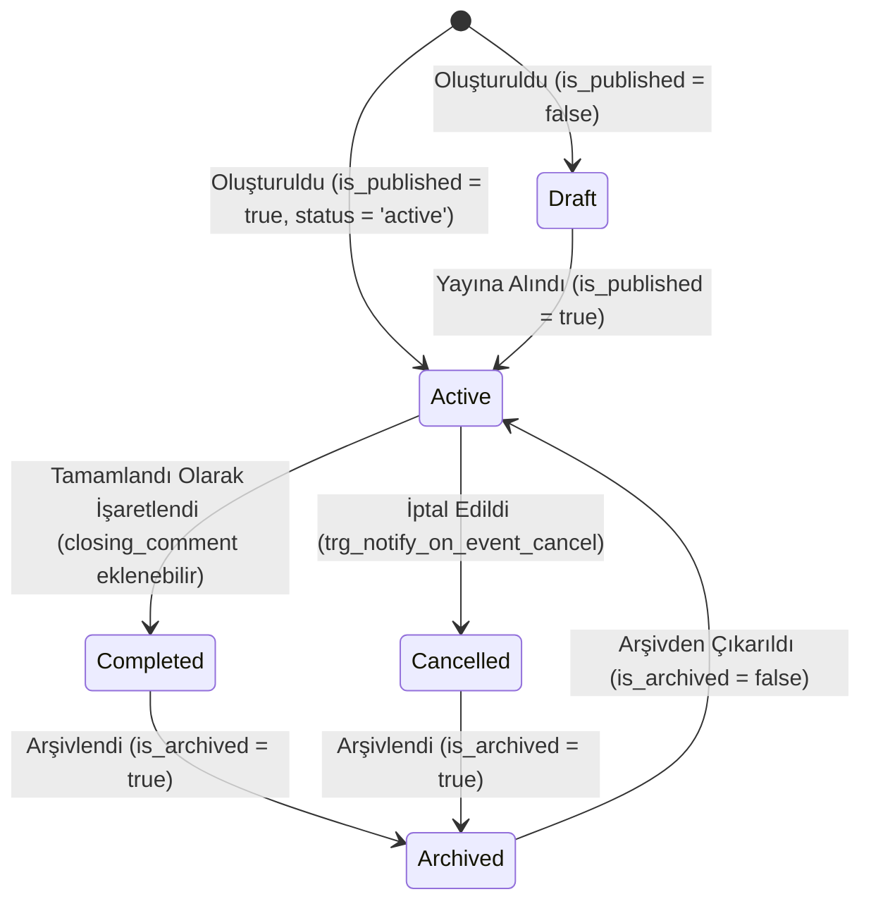
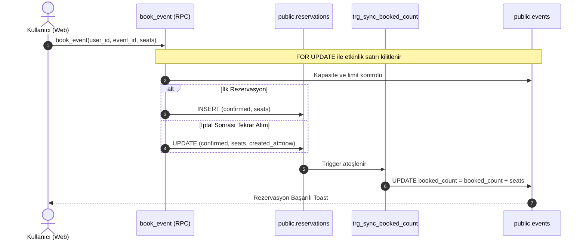

# Özellik ve Kullanıcı Akış Haritası (feature-map.md)

Bu doküman, sistemdeki temel iş kurallarını, kullanıcı akışlarını ve veri geçişlerini **Özellik → Giriş Noktası → Veri Akışı → Yetki Kontrolü → İlgili Dosyalar** formatında açıklar.

---

## 1. Rota ve Ekran Envanteri

| Rota | Ekran / Bileşen | Erişim Seviyesi | Sorumluluk |
| :--- | :--- | :--- | :--- |
| `/login` | [`Login.tsx`](file:///C:/Users/Mert/event-reservation-app/apps/web/src/pages/Login.tsx) | Anonim / Public | Giriş yapma, yeni kayıt oluşturma, onay durumu yönlendirmesi |
| `/` | [`UserFeed.tsx`](file:///C:/Users/Mert/event-reservation-app/apps/web/src/pages/UserFeed.tsx) | PublicRoute | Yayındaki aktif ve tamamlanmış etkinlikleri arama, filtreleme, listeleme |
| `/events/:id` | [`EventDetails.tsx`](file:///C:/Users/Mert/event-reservation-app/apps/web/src/pages/EventDetails.tsx) | PublicRoute | Etkinlik detayı, rezervasyon yapma, bilet adedi güncelleme, iptal, katılımcı listesi |
| `/my-bookings` | [`MyBookings.tsx`](file:///C:/Users/Mert/event-reservation-app/apps/web/src/pages/MyBookings.tsx) | Protected (`user`) | Kullanıcının kendi onaylı aktif ve geçmiş rezervasyonlarını listeleme |
| `/profile` | [`UserProfile.tsx`](file:///C:/Users/Mert/event-reservation-app/apps/web/src/pages/UserProfile.tsx) | Protected (`user`) | Profil düzenleme, avatar yükleme, gizli hesap anahtarı ve Destek Talepleri (`?tab=support`) |
| `/admin` | [`AdminDashboard.tsx`](file:///C:/Users/Mert/event-reservation-app/apps/web/src/pages/AdminDashboard.tsx) | Protected (`admin`) | Kullanıcı onay/red listesi, kullanıcı detay çekmecesi, manuel rezervasyon oluşturma/iptali, metrikler |
| `/admin/events` | [`AdminEvents.tsx`](file:///C:/Users/Mert/event-reservation-app/apps/web/src/pages/AdminEvents.tsx) | Protected (`admin`) | Etkinlik oluşturma/düzenleme, banner yükleme, durum değiştirme (aktif/tamamlandı/iptal), arşivleme |
| `/admin/events/:id` | [`AdminEventDetails.tsx`](file:///C:/Users/Mert/event-reservation-app/apps/web/src/pages/AdminEventDetails.tsx) | Protected (`admin`) | Etkinlik bazlı katılımcı listesi, CSV indirme, audit logları, kapanış notu ekleme |
| `/admin/broadcast` | [`AdminBroadcast.tsx`](file:///C:/Users/Mert/event-reservation-app/apps/web/src/pages/AdminBroadcast.tsx) | Protected (`admin`) | Toplu (tüm onaylı kullanıcılar) veya hedefe özel (tek kullanıcı / etkinlik katılımcıları) bildirim gönderme |
| `/admin/tickets` | [`AdminTickets.tsx`](file:///C:/Users/Mert/event-reservation-app/apps/web/src/pages/AdminTickets.tsx) | Protected (`admin`) | Kullanıcı destek taleplerini gerçek zamanlı yanıtlama ve çözüme kavuşturma |

---

## 2. Kimlik Doğrulama, Kullanıcı Onayı ve Profil Gizliliği

### 2.1. Giriş ve Kayıt Akışı
- **Giriş Noktası:** `/login` ([`Login.tsx`](file:///C:/Users/Mert/event-reservation-app/apps/web/src/pages/Login.tsx))
- **Veri Akışı:**
  1. Kullanıcı `signUp` çağrısı yapar. Supabase Auth kullanıcısı oluşur.
  2. Postgres trigger'ı `on_auth_user_created` (Bkz: `0005_core_overhaul.sql`) otomatik çalışarak `public.users` tablosuna `role = 'user'` ve `approval_status = 'pending'` değerleriyle bir satır ekler.
  3. Kullanıcı giriş yaptığında `signInWithPassword` sonrasında `public.users` tablosundan `role` ve `approval_status` sorgulanır.
  4. Eğer `approval_status !== 'approved'` ve `role !== 'admin'` ise oturum kapatılır (`signOut`) ve kullanıcıya "Hesabınız yönetici onayı bekliyor" uyarısı gösterilir.
- **Yetki Kontrolü:**
  - UI Katmanında: `Login.tsx` onay durumunu kontrol edip `signOut` çağırır.
  - Context Katmanında: `packages/core/src/hooks/useAuth.tsx` auth durumunu dinler, `approval_status === 'rejected'` ise derhal oturumu sonlandırır.
  - **Kritik Güvenlik Uyarısı (SEC-001):** Rota koruyucusu [`ProtectedRoute.tsx`](file:///C:/Users/Mert/event-reservation-app/apps/web/src/components/ProtectedRoute.tsx) yalnızca `profile.role` kontrolü yapmakta, `approval_status === 'approved'` kontrolü **yapmamaktadır**. Oturumu açık kalmış veya doğrudan token ile gelen bekleyen kullanıcılar `/my-bookings` ve `/profile` rotalarına girebilmektedir.

### 2.2. Yönetici Tarafından Kullanıcı Onayı / Reddi
- **Giriş Noktası:** `/admin` ([`AdminDashboard.tsx`](file:///C:/Users/Mert/event-reservation-app/apps/web/src/pages/AdminDashboard.tsx))
- **Veri Akışı:**
  - Admin `Bekleyenler` sekmesinden bir kullanıcıyı "Onayla" veya "Reddet" butonuna tıklar.
  - `supabase.from('users').update({ approval_status: 'approved' | 'rejected' }).eq('id', userId)` çalıştırılır.
- **Yetki Kontrolü:**
  - DB Trigger: `trg_protect_user_privileges` (`0010_production_hardening.sql`), sadece `role = 'admin'` olanların `role` ve `approval_status` değiştirebilmesini zorunlu kılar.

### 2.3. Profil Gizliliği ve 24 Saatlik Bekleme Süresi (Cooldown)
- **Giriş Noktası:** `/profile` ([`UserProfile.tsx`](file:///C:/Users/Mert/event-reservation-app/apps/web/src/pages/UserProfile.tsx))
- **Veri Akışı:**
  - Kullanıcı "Gizli Hesap" anahtarını (`isPrivate`) değiştirir ve "Değişiklikleri Kaydet" butonuna basar.
  - `users.update({ is_private, ... })` gönderilir.
  - Başarılı olursa `privacy_changed_at` güncellenir. Arayüzde bir sonraki değişime kadar kalan süreyi gösteren canlı geri sayım (`now` state interval) başlar.
- **Yetki Kontrolü:**
  - DB Trigger: `trg_enforce_privacy_cooldown` (`0027_privacy_cooldown_and_category_sync.sql`), admin olmayan kullanıcıların son değişim üzerinden 24 saat geçmeden `is_private` değerini tekrar değiştirmesini engeller (hata fırlatır: "Gizlilik ayarı 24 saat içinde sadece bir kez değiştirilebilir.").

---

## 3. Katılımcı Görünürlüğü (Attendee Visibility)

- **Giriş Noktası:** `/events/:id` ([`EventDetails.tsx`](file:///C:/Users/Mert/event-reservation-app/apps/web/src/pages/EventDetails.tsx)) -> `AttendeeStack` / `AttendeesModal`
- **Tasarım İlkesi:** Katılımcı gizliliği **kesinlikle frontend filtrelemesine bırakılmaz**. `public.users` tablosu RLS politikası gereği kullanıcıların sadece kendi satırlarını okumasına izin verir.
- **Veri Akışı:**
  - Frontend, `supabase.rpc('get_public_event_attendees', { p_event_id: id })` çağrısı yapar.
  - RPC (`get_public_event_attendees` - `0026` ve yerel `0030` migration'ı):
    - Çağıran oturumun kimliği doğrulanır (`auth.uid()`). Anonim kullanıcılar boş liste alır.
    - Sadece `r.status = 'confirmed'` ve `u.is_private = false` olan katılımcıların `id`, `full_name`, `avatar_url` alanları döner.
- **Kritik Güncel Durum (0026 vs 0030 Farkı):**
  - Migration 0026'da gizlilik "karşılıklı (reciprocal)" idi: Gizli profilli kullanıcılar başkalarını da göremiyordu.
  - Yerel uncommitted 0030 migration'ı ve `EventDetails.tsx` değişikliği ile bu kural **tek taraflı** hale getirilmiştir: Gizli profilli kullanıcı başkalarını görebilir, ancak kendi adı listelerde asla yer almaz.

---

## 4. Etkinlik Yaşam Döngüsü (Oluşturma, Yayınlama, Tamamlama, İptal, Arşivleme)

- **Giriş Noktası:** `/admin/events` ([`AdminEvents.tsx`](file:///C:/Users/Mert/event-reservation-app/apps/web/src/pages/AdminEvents.tsx))

### Akış Ayrıntıları ve Yan Etkiler:
1. **Oluşturma / Düzenleme:**
   - Görsel seçilirse `event-banners` bucket'ına yüklenir.
   - `events` tablosuna `category_id`, `category` (senkron metin), `capacity`, `max_tickets_per_user`, `price`, `event_date`, `is_published` kaydedilir.
2. **Tamamlama (`status = 'completed'`):**
   - Etkinlik sonlandığında admin tarafından seçilir.
   - `/admin/events/:id` üzerinden `closing_comment` (kapanış notu) girilebilir. Kullanıcılar bu notu etkinlik detay sayfasında görür.
3. **İptal Etme (`status = 'cancelled'`):**
   - Admin durumu `cancelled` yapar.
   - DB Trigger: `trg_notify_on_event_cancel` (`0012_notification_system.sql`) çalışır. Onaylı tüm rezervasyon sahiplerine bildirim üretir.
   - **Kritik Hata (BUG-002):** Trigger rezervasyon satırlarını `cancelled` yapmaz! Ayrıca `0029` migration RLS politikası kullanıcıların iptal edilmiş etkinlikleri görmesini engellediği için, bu bildirimdeki linke tıklayan kullanıcı "Etkinlik bulunamadı" hatası alır.
4. **Arşivleme / Soft-Delete (`is_archived = true`):**
   - Etkinlik fiziksel olarak silinmez (`0029_event_soft_delete_and_status.sql`).
   - RLS politikası sayesinde normal kullanıcı sorgularından gizlenir; ancak adminler filtreleyip görebilir ve geri alabilir (`ArchiveRestore`).

---

## 5. Rezervasyon, Kişi Sayısı Değişimi, İptal ve Kapasite Akışı

- **Giriş Noktaları:**
  - Kullanıcı: `/events/:id` ([`EventDetails.tsx`](file:///C:/Users/Mert/event-reservation-app/apps/web/src/pages/EventDetails.tsx))
  - Kullanıcı Listesi: `/my-bookings` ([`MyBookings.tsx`](file:///C:/Users/Mert/event-reservation-app/apps/web/src/pages/MyBookings.tsx))
  - Admin: `/admin` ([`AdminDashboard.tsx`](file:///C:/Users/Mert/event-reservation-app/apps/web/src/pages/AdminDashboard.tsx))

### Kapasite ve Sayacın Tutarlılık Mekanizması:
- **Eşzamanlılık (Concurrency) Koruması:** `book_event` RPC'si (`0015_admin_overrides_notif_delete.sql:47`) etkinlik satırını `SELECT ... FOR UPDATE` ile kilitler. İki kullanıcı aynı anda tıkladığında sıralı işlem görür; kapasite aşımı imkansızdır.
- **Tek Sayacı Yöneten Otorite:** `events.booked_count` değeri `book_event` fonksiyonu tarafından **doğrudan yazılmaz**. `trg_sync_booked_count` trigger'ı (`0015_admin_overrides_notif_delete.sql:105`) `reservations` tablosundaki her INSERT, UPDATE (koltuk artış/azalış veya iptal) ve DELETE durumunda matematiksel olarak farkı `events.booked_count` üzerine yansıtır.
- **Kişi Sayısını Güncelleme:**
  - Kullanıcı `EventDetails.tsx` içindeki `SeatStepper` ile adedi değiştirip "Güncelle" dediğinde doğrudan `reservations.update({ tickets_requested: selectedSeats })` çalışır.
  - `sync_booked_count` trigger'ı `(v_booked - OLD + NEW) > v_capacity` kontrolü yaparak yer yoksa işlemi engeller, yer varsa sayacı artırır/azaltır.
- **İptal:**
  - Kullanıcı modal onayıyla `reservations.update({ status: 'cancelled' })` çalıştırır.
  - Trigger `booked_count` değerini serbest bırakır: `GREATEST(0, booked_count - OLD.tickets_requested)`.

---

## 6. Destek Talepleri, Bildirimler ve Edge Functions

### 6.1. Destek Talepleri (Support Tickets)
- **Giriş Noktası:** `/profile?tab=support` ([`UserProfile.tsx`](file:///C:/Users/Mert/event-reservation-app/apps/web/src/pages/UserProfile.tsx)) ve `/admin/tickets` ([`AdminTickets.tsx`](file:///C:/Users/Mert/event-reservation-app/apps/web/src/pages/AdminTickets.tsx))
- **Ortak Bileşen:** [`TicketChat.tsx`](file:///C:/Users/Mert/event-reservation-app/apps/web/src/components/TicketChat.tsx)
- **Veri Akışı:**
  1. Kullanıcı yeni konu açar (`support_tickets` INSERT).
  2. Kullanıcı veya Admin mesaj gönderir (`ticket_messages` INSERT).
  3. Mesajlar Supabase Realtime (`ticket-msgs-<id>` kanalı) üzerinden anlık olarak akar.
  4. Yönetici cevap yazdığında `fn_notify_on_ticket_reply` (`0020_security_patch_and_links.sql`) trigger'ı kullanıcıya `/profile?tab=support&ticketId=<id>` deep linki içeren bir bildirim üretir.
  5. Yönetici talebi "Çözüldü" olarak işaretlediğinde `support_tickets.update({ status: 'resolved' })` yapılır ve chat salt-okunur (locked) duruma geçer.

### 6.2. Bildirim Sistemi ve Çan (Notification Bell)
- **Bileşen:** [`NotificationBell.tsx`](file:///C:/Users/Mert/event-reservation-app/apps/web/src/components/NotificationBell.tsx)
- **Veri Akışı:**
  - `user_id = profile.id` filtresiyle Realtime `notif-<userId>` kanalı dinlenir.
  - Yeni bildirim geldiğinde çan simgesinde rozet güncellenir ve ses çalar (`notification.mp3`).
  - Eğer kullanıcının o an ekranda açık tuttuğu destek talebine ait bir yanıt bildirimi geldiyse (`activeTicketId === notifTicketId`), ses ve bildirim bastırılır ve otomatik okundu yapılır ([`activeTicket.ts`](file:///C:/Users/Mert/event-reservation-app/apps/web/src/lib/activeTicket.ts)).

### 6.3. Edge Functions ve SMS/Push Entegrasyonu
- **`send-booking-sms`:**
  - Rezervasyon yapıldığında `trg_send_booking_sms_on_reservation` (`0025`) trigger'ı ile tetiklenir.
  - Deno Edge Function `supabase/functions/send-booking-sms/index.ts` çalışır.
  - **Mevcut Durum:** Kod içinde Twilio entegrasyonu bir **STUB (taslak)** olarak durmaktadır. Gerçek SMS gönderimi yapılmamakta, konsola log yazılmaktadır.
- **`send-push`:**
  - `notifications` tablosuna INSERT yapıldığında `trg_send_push_on_notification` (`0022`) trigger'ı tetiklenir.
  - Deno Edge Function `supabase/functions/send-push/index.ts` çalışır ve kullanıcının `push_token` değerini Expo sunucularına (`https://exp.host/--/api/v2/push/send`) iletir.
  - **Mevcut Durum:** Yalnızca mobil Expo kullanıcıları için anlamlıdır.

---

## 7. Ortak Alan Değişikliklerinde Etki Analizi Matrisi

Ortak bir alan veya iş kuralı değiştiğinde etkilenecek katmanlar:

| Değişen Alan / Tablo | Etkilenen Ekranlar | Etkilenen Trigger / RPC | Dış Servis / Fonksiyon |
| :--- | :--- | :--- | :--- |
| `events.status` | `UserFeed`, `EventDetails`, `MyBookings`, `AdminEvents`, `AdminEventDetails` | `trg_notify_on_event_cancel`, RLS `events: users view active or completed` | - |
| `events.capacity` | `EventDetails`, `AdminEvents`, `AdminDashboard` | `book_event`, `sync_booked_count`, `trg_notify_on_capacity_threshold` | Edge Function: `send-push` |
| `events.category_id` / `category` | `UserFeed`, `EventDetails`, `AdminEvents`, `CategoryManagerModal` | `trg_notify_on_capacity_threshold` | `user_interests` upsert |
| `users.approval_status` | `Login`, `ProtectedRoute`, `AdminDashboard`, `EventDetails` | `protect_user_privileges` | `notify_on_new_event` |
| `users.is_private` | `UserProfile`, `EventDetails` (Katılımcı listesi) | `get_public_event_attendees`, `trg_enforce_privacy_cooldown` | - |
| `support_tickets.status` | `UserProfile`, `AdminTickets`, `AdminLayout` (Rozet) | Realtime `admin-open-ticket-count`, `profile-support-tickets` | - |
